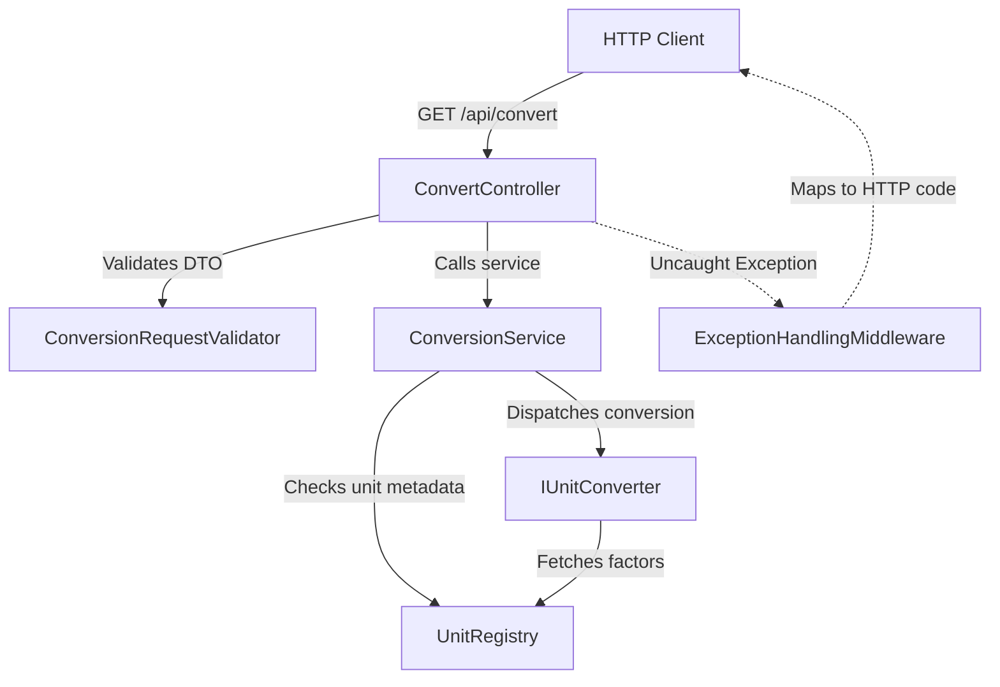

# Architectural Documentation

This document describes the structural logic, design paradigm, and component layout for the Unit Conversion Web API.

---

## Design Paradigm: Clean Architecture & Separation of Concerns
This project is structured around the principles of **Clean Architecture** to ensure that logic is decoupled from external interfaces like web frameworks, databases, or test runners. 

* **Domain-Centric Design**: The core business logic (math, converters, registry) resides in the `Domain` project, which has zero dependencies on any web frameworks or outer layers. It can be easily embedded in a CLI, a mobile app, or a background worker.
* **Separation of Concerns**: Each project layer has a single, well-defined responsibility:
  - **Domain Project**: Handles core business logic, units configuration, and raw arithmetic.
  - **API Project**: Handles HTTP requests, Swagger UI configurations, middleware routing, and input DTO binding.
  - **Tests Project**: Verifies both individual classes (unit testing) and full endpoint flow (integration testing).

---

## Component Layout & File Directory

Here is a summary of all key files, grouped by architectural responsibility:

### 1. Domain Layer (`src/UnitConversion.Domain`)
* **[Models/](../src/UnitConversion.Domain/Models)** (Data Contracts):
  * [UnitDefinition.cs](../src/UnitConversion.Domain/Models/UnitDefinition.cs): Holds immutable metadata about a unit (Name, Category, factor relative to base).
  * [ConversionRequest.cs](../src/UnitConversion.Domain/Models/ConversionRequest.cs): Record representing a conversion request.
  * [ConversionResult.cs](../src/UnitConversion.Domain/Models/ConversionResult.cs): Record representing a completed conversion output.
* **[Exceptions/](../src/UnitConversion.Domain/Exceptions)** (Domain Errors):
  * [UnsupportedUnitException.cs](../src/UnitConversion.Domain/Exceptions/UnsupportedUnitException.cs): Thrown when a unit name is unrecognized.
  * [InvalidConversionException.cs](../src/UnitConversion.Domain/Exceptions/InvalidConversionException.cs): Thrown when invalid operations are attempted (e.g. cross-category conversion).
* **[Converters/](../src/UnitConversion.Domain/Converters)** (Conversion Engines):
  * [IUnitConverter.cs](../src/UnitConversion.Domain/Converters/IUnitConverter.cs): Common contract that all conversion classes must implement.
  * [LinearUnitConverter.cs](../src/UnitConversion.Domain/Converters/LinearUnitConverter.cs): Strategy implementation handling multiply/divide factors for static units (Length, Weight).
  * [TemperatureConverter.cs](../src/UnitConversion.Domain/Converters/TemperatureConverter.cs): Strategy implementation handling custom offset calculations for Temperature.
* **[Services/](../src/UnitConversion.Domain/Services)** (Coordinating Service):
  * [IUnitRegistry.cs](../src/UnitConversion.Domain/Services/IUnitRegistry.cs) & [UnitRegistry.cs](../src/UnitConversion.Domain/Services/UnitRegistry.cs): Centrally indexes all units and their attributes.
  * [IConversionService.cs](../src/UnitConversion.Domain/Services/IConversionService.cs) & [ConversionService.cs](../src/UnitConversion.Domain/Services/ConversionService.cs): Orchestrates unit verification, handles optimization (same unit), and invokes the correct converter.

### 2. Infrastructure & Web Layer (`src/UnitConversion.Api`)
* **[Controllers/ConvertController.cs](../src/UnitConversion.Api/Controllers/ConvertController.cs)**: HTTP GET endpoints that accept requests, execute validations, and return JSON content.
* **[Controllers/HealthController.cs](../src/UnitConversion.Api/Controllers/HealthController.cs)**: HTTP GET endpoint exposing service health status, diagnostics, and system metrics.
* **[HealthChecks/UnitRegistryHealthCheck.cs](../src/UnitConversion.Api/HealthChecks/UnitRegistryHealthCheck.cs)**: Custom health check assessing the loaded state of the unit registry.
* **[Models/ConversionRequestDto.cs](../src/UnitConversion.Api/Models/ConversionRequestDto.cs)**: Data transfer object for query parameter binding.
* **[Models/HealthResponseDto.cs](../src/UnitConversion.Api/Models/HealthResponseDto.cs)**: Data transfer objects structuring the system health metrics response.
* **[Validation/ConversionRequestValidator.cs](../src/UnitConversion.Api/Validation/ConversionRequestValidator.cs)**: Validator checking for required parameters and finite numbers.
* **[Middleware/ExceptionHandlingMiddleware.cs](../src/UnitConversion.Api/Middleware/ExceptionHandlingMiddleware.cs)**: Catch-all handler transforming domain exceptions into standard HTTP status responses (`400 BadRequest`, `404 NotFound`).
* **[Program.cs](../src/UnitConversion.Api/Program.cs)**: Startup class configuring Dependency Injection (DI) and Kestrel request routing.

### 3. Testing Layer (`tests/`)
* **Unit Tests Project (`tests/UnitConversion.UnitTests`)**:
  * [ConversionServiceTests.cs](../tests/UnitConversion.UnitTests/ConversionServiceTests.cs): Isolated class tests validating specific math, offset bounds, and exception behavior.
* **Integration Tests Project (`tests/UnitConversion.IntegrationTests`)**:
  * [ConvertApiIntegrationTests.cs](../tests/UnitConversion.IntegrationTests/ConvertApiIntegrationTests.cs): Full stack tests using `WebApplicationFactory` to spin up a test server and assert JSON schemas, validations, and status codes.

---

## How Everything Comes Together

1. **Routing & Binding**: An HTTP request hits the API. ASP.NET Core routes it to the `ConvertController` and binds query parameters to the `ConversionRequestDto`.
2. **Validation**: The controller invokes `ConversionRequestValidator`. If invalid, an `ArgumentException` is thrown, which the global `ExceptionHandlingMiddleware` intercepts to return `400 BadRequest`.
3. **Registry Check**: The controller calls `ConversionService`. The service asks `IUnitRegistry` to resolve the two units. If they do not exist, it throws `UnsupportedUnitException` (intercepted as `404 NotFound`).
4. **Short-circuiting**: If the units are identical (e.g. meters to meters), the service skips calculation and returns the original value instantly.
5. **Strategy Execution**: The service finds the appropriate `IUnitConverter` matching the category (e.g. `LinearUnitConverter` for Length). The converter fetches the registered scale factors from `IUnitRegistry`, performs the math, and returns the converted value.
6. **Response Out**: The service wraps the result in a `ConversionResult` record, and the controller serializes it to JSON string, sending it back to the client as `200 OK`.

---

## 4. Containerization & Deployment

To support cross-platform deployment and standard DevOps workflows, the project includes:
- **[Dockerfile](../src/UnitConversion.Api/Dockerfile)**: Multi-stage build configuration that builds and publishes the API using a clean **Ubuntu 24.04** base image. It securely installs the .NET 8 SDK and ASP.NET Core 8 runtime directly from Ubuntu's native package feeds to guarantee reliable image pulling across restricted networks.
- **[docker-compose.yml](../docker-compose.yml)**: High-level orchestration that spins up the API container on port 5000 and isolates it within a standard `unit-conversion-net` bridge network.

